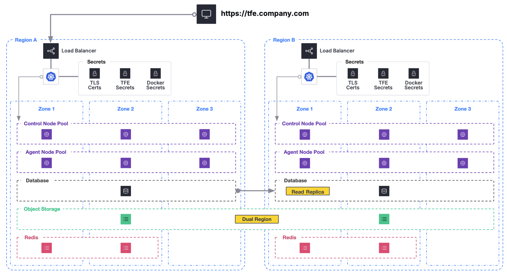

# Dual Region TFE Deployment on GCP

This repository contains Terraform code to deploy a dual region Terraform Enterprise (TFE) deployment on Google Cloud Platform (GCP). The deployment consists of a blue and green installation of TFE in two regions within the same GCP project. The deployment is designed to be allow for demonstration of failover (and failback) in the event of a disaster in a region.

The initial deployment will have blue as the primary region and green as the secondary region. The deployment is designed to have the ability to failover easily.

This is not production ready code and should be used for testing and learning purposes only. The goal here is to simulate a dual region TFE deployment on GCP and understand the various components involved in the deployment. The deployment is not optimized for cost or performance and should not be used in a production environment.

## Getting Started

Before you begin, please read this section in its entirety. This will help you understand the deployment architecture, the resources that will be created, and the prerequisites for deploying the code.

### About this Repository

Folder Structure:

- `./terraform/`
  - Contains all the Terraform to bootstrap the GCP Project and create the TFE resources in two regions
  - You must create a `terraform.tfvars` file in this directory (see Examples directory).
- `./kubernetes/`
  - Place to store the Helm override files for each GKE Cluster
  - 2 files will be created by Terraform that represent the primary and secondary region helm overrides.
- `./examples/`
  - Contains example files for easier reference when using this repository
  - Some files included are `terraform.tfvars` and `.env`
- `./secrets/`
  - Place to store a `.env` file with the required secrets for the Taskfile
  - You must create this file and populate it with the required secrets (see Examples directory) if you are using the Taskfile.

### Taskfile

This repository heavily uses [Task](https://taskfile.dev/) to manage operations. While it is not required to use Task, it is recommended to install Task to simplify the process.

The syntax is simple and easy to understand.
Here is an example of how to run the `gcp-auth` task, which can be run from any directory in the repository:
```
task gcp-auth
```

> [!NOTE]
> If you do not wish to use Task, the commands can be referenced easily to see how to run them manually.

In order to keep values and secrets out of this repository, you will need to create a `.env` file in the `secrets` directory. This will contain values referenced by the tasks.

### k9s

How you choose to manage and interact with GKE is purely up to you but I would be remise if I did not mention [k9s](https://k9scli.io/). This is a fantastic tool for managing Kubernetes clusters and is highly recommended.

An example of how to use k9s to view the pods: `k9s -n tfe`.

> [!NOTE]
> For this setup we will need to specify the context for the cluster we are working with. This can be done by running something like `k9s -n tfe --context=gke_{Project ID}_{Region}_{Cluster Name}`. Where the context is created in the `~/.kube/config` file that is modified when you authenticate to the cluster.

### Prerequisites

There are a few things you will need to leverage this repository:
- GCP Project
  - Have the Project ID ready
  - Have the `gcloud` CLI installed and authenticated
    ```sh
    gcloud config set project [Project ID] 
    task gcp-auth
    ```
- Domain with and associated public DNS Zone as a [Google Cloud DNS](https://cloud.google.com/dns/docs/overview)
  - Have the DNS Zone name ready
- Terraform Binary

### Setup GCP Project

There are several Google API's we need to enable in the GCP project. You can enable these API's using the `gcloud` CLI or the GCP Console. 

Run the following command to enable the required API's using the `gcloud` CLI:
```sh
task gcp-setup
```

## Architecture

The infrastructure deployed here is best summarized in the diagram below:



We will deploy all the infrastructure we can in both regions, but only the TFE application will be active in the primary region. The secondary region will not have the TFE application installed and the database will be a read replica. The goal is to have the ability to failover to the secondary region in the event of a disaster in the primary region.

## Resources

Within the `./terraform/` directory there are a few resources and several modules that are used to deploy the infrastructure. 

The resources are as follows:
- [root] DNS Entry
- [bootsrap] Core Infrastructure used by both regions
  - Networking
  - (2) Subnets (1 per region)
  - TLS Certificates for TFE (Generated by Let's Encrypt)
  - Firewall rules
  - Bastion Host (Optional)
  - Service Accounts for TFE and GKE, with proper permissions
  - Secrets Manager Secrets for TFE
    - One exception here is the Redis password, this is created by the TFE module per region because GCP does not allow you to set this password, it can only be read.
- [tfe-blue] TFE Infrastructure for the (initially) primary region
  - GKE Cluster
    - Control Node Pool (TFE Application)
    - Agent Node Pool (TFE Agents)
  - GCS Bucket
    - Configured for dual regions
  - PSQL Database
    - Configured as the Active Instance
  - Redis Instance
  - Secrets Manage Secret for region specific Redis
  - Internal and External IP Addresses (for both Load Balancer options)
  - Local File for Helm Overrides
- [tfe-green] TFE Infrastructure for the (initially) secondary region
  - GKE Cluster
    - Control Node Pool (TFE Application)
    - Agent Node Pool (TFE Agents)
  - PSQL Database
    - Configured as the Read Replica Instance
  - Redis Instance
  - Secrets Manage Secret for region specific Redis
  - Internal and External IP Addresses (for both Load Balancer options)
  - Local File for Helm Overrides

### Load Balancer Options

We have two options on the load balancer, however the default here since this is for demonstration purposes is to use a Public Load Balancer.

#### Public Load Balancer

This is the default option and is the easiest to setup. This will create a public load balancer that will be accessible from the internet. 

```
service:
  annotations:  
    cloud.google.com/l4-rbs: enabled
    networking.gke.io/load-balancer-ip-addresses: tfe-lb-external-ip
  type: LoadBalancer
  port: 443
```

#### Internal Load Balancer

If desired, a private load balancer can be created. This will only be accessible from within the VPC. This is useful if you want to replicate a restricted access environment to the TFE application to only internal users.

```
service:
  annotations:  
    networking.gke.io/load-balancer-type: Internal
    networking.gke.io/load-balancer-ip-addresses: tt-tfe-blue-internal
  type: LoadBalancer
  port: 443
```

> [!NOTE]
> To use this option be sure to set the `is_tfe_public` variable for the `tfe` modules to false.

## Deployment

Ok, now we are ready for the fun stuff. Let's deploy the infrastructure and then install Terraform Enterprise!

### Terraform

All commands will be run from the `./terraform/` directory.

First thing we need to do is create a `terraform.tfvars` file. This file will contain all the variables needed to deploy the infrastructure. You can use the `./examples/terraform.tfvars` file as a reference, but a few notes:

- "namespace" is the string that is prepended to all resources created in the GCP project. It is recommended that this string includes "-tfe". For example, I often use "tt-tfe"
- The regions should be in the same continent for the best performance. For example, us-central1 and us-east1.
- The `tfe_domain` should be the domain you have registered and have a public DNS zone for in GCP.

Once you have created the `terraform.tfvars` file we can apply our Terraform.

If successful, we will have all the infrastructure created in GCP. We can now move on to installing Terraform Enterprise in the blue region (primary).

While the helm overrides files are created by Terraform in the `./kubernetes/` directory, you can verify these settings against the `terraform output` as well. If you are going to modify these files it might be a good idea to copy them to a different directory so they are not overwritten by Terraform.

### Terraform Enterprise Installation

In order to install Terraform Enterprise we will need to use the Helm chart provided by Hashicorp, but first a few things need to happen and in this order.

1. Create the TFE Database and User (this only has to be done once)
   - Run `task tfe-create-database && task tfe-create-database-user`.
   - It was an intentional decision to not automate this step with Terraform. This was purely to make failover and failback easier to manage in Terraform.
   - These steps are built into a `local-exec` provisioner in the `tfe-blue` module but there was consistency issues, so running these tasks manually is recommended before proceeding to ensure the Database and User are created.
2. Authenticate to GKE
   - Run `task gke-auth-primary` to authenticate to the blue region GKE cluster.
   - Run `task gke-auth-secondary` to authenticate to the green region GKE cluster.
   - This will create entries in your `~/.kube/config` file so we can connect with `helm`, `kubectl`, and `k9s`.
3. Prepare GKE in the Blue Region
   - Run `task tfe-pre-primary` to create the namespace.
   - Run `task tfe-secrets-primary` to create the secrets in the namespace.
4. Prepare GKE in the Green Region
   - Run `task tfe-pre-secondary` to create the namespace.
   - Run `task tfe-secrets-secondary` to create the secrets in the namespace.

> [!NOTE]
> At this point both GKE clusters are ready to have Terraform Enterprise installed, however only the blue region can actually be installed since it is the region with the active Database.

5. Install TFE in the Blue Region
   - Run `task tfe-install-primary` to install Terraform Enterprise in the blue region.
   - Verify TFE is up and running on the Load Balance DNS endpoint that was created by Terraform.
   - Run `task tfe-initial-user` to create a URL to set the initial admin user password.

### Seed Terraform Enterprise

At this point TFE should be up and running in the blue region. If you are doing a demo or testing, it is best to create an Organization and some Workspaces. It is up to you on how much data you wish to seed here, but create something to allow a better demonstration of the data replication across GCP Regions.

### Failover

Ok, we have TFE with some data, now let's simulate a failover to the green region.

1. Stop TFE in the Blue Region
   - Run `task tfe-uninstall-primary` to stop TFE in the blue region.
> [!CAUTION]
> It is **critical** that any open TFE database connections be closed to the primary region Database. However, forcing a promotion of the read replica will permanently sever this, just be sure to promote the read replica before installing TFE into the secondary region.
2. Promote the Read Replica in the green region
   - Run `task psql-promote-replica-from-primary` to promote the read replica that is in the green region to be the primary instance, this will irreversibly sever the connection to the blue region database.
   - The terminal will prompt you to confirm this action.
   - Be sure to wait for the command to complete before proceeding.
3. Install TFE in the Green Region
   - Run `task tfe-install-secondary` to install Terraform Enterprise in the green region.
4. Update `terraform.tfvars` to make the green region the primary region:
  - Set `is_blue_primary` to `false`.
  - Run `terraform apply` again to update the infrastructure
    - This will update the DNS entry to point to the green region's Load Balancer.
    - Also the Database in blue will be deleted and recreated but this time as a read replica of the now active database in the green region.
5. Verify TFE is up and running on the Load Balance DNS endpoint that was created by Terraform.

Congratulations you have now failed over to the green region, and the blue region is now the secondary region. You can now failback to the blue region by following the same steps again, but swapping green for blue and vice versa.

## Something Went Wrong, What Now?

Here are some helpful bits to debug and troubleshoot the deployment, although the HVD module has far more useful information.

### Logs

TFE Logs can be found on the Pod running the TFE Application.

These can be found at `/var/log/terraform-enterprise/`.

### Known Issues

```
│ Error: Error applying IAM policy for service account 'projects/hc-a416c9627ad143f9abef6c691c4/serviceAccounts/tt-tfe-sa@hc-a416c9627ad143f9abef6c691c4.iam.gserviceaccount.com': Error setting IAM policy for service account 'projects/hc-a416c9627ad143f9abef6c691c4/serviceAccounts/tt-tfe-sa@hc-a416c9627ad143f9abef6c691c4.iam.gserviceaccount.com': googleapi: Error 400: Identity Pool does not exist (hc-a416c9627ad143f9abef6c691c4.svc.id.goog). Please check that you specified a valid resource name as returned in the `name` attribute in the configuration API., badRequest
```

```
resource "google_service_account_iam_binding" "tfe_workload_identity" {
  service_account_id = google_service_account.tfe.id
  role               = "roles/iam.workloadIdentityUser"

  members = [
    "serviceAccount:${var.project_id}.svc.id.goog[${var.tfe_kubernetes_namespace}/${var.tfe_kubernetes_namespace}]"
  ]
}
```

## References and Acknowledgements

The Terraform code in this repository is heavily influences by the great work by the contributors of Terraform module for deploying Terraform Enterprise on GCP HVD and can be found [here](https://github.com/hashicorp/terraform-google-terraform-enterprise-gke-hvd).

- [Hashicorp Helm Chart for TFE](https://github.com/hashicorp/terraform-enterprise-helm)
